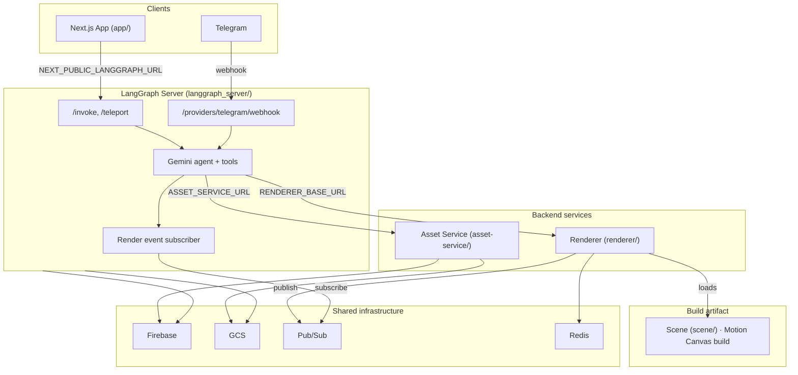
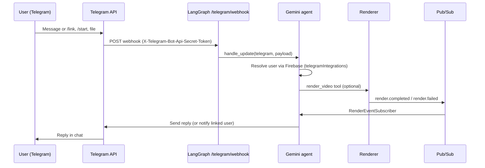
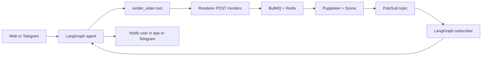

# Gemini Studio

A microservices-based video editing and AI-assisted production platform. Users edit timelines in a Next.js web app, chat with a LangGraph agent that can manipulate the project and trigger renders, upload and process media via a dedicated asset service, and export videos through a headless Motion Canvas renderer backed by BullMQ and FFmpeg.

## Overview

- **Web app** – Next.js frontend with a timeline editor, asset panel, and chat UI that talks to the LangGraph agent.
- **LangGraph server** – Gemini-powered agent with tools to list assets, queue video renders, and optional **Telegram bot** (webhook). Same agent serves the web app (`/invoke`, `/teleport`) and Telegram (`/providers/telegram/webhook`). Persists conversation state and subscribes to render-completion events via Pub/Sub; can notify users in the app or on Telegram when a render finishes.
- **Asset service** – Python service for uploads, GCS storage, Firestore metadata, and a pluggable pipeline (shot/label/person/face detection, transcription).
- **Renderer** – Node.js service that accepts render jobs via HTTP, processes them with BullMQ + Redis, drives Motion Canvas in headless Chrome, and publishes completion/failure events to Google Cloud Pub/Sub.
- **Scene** – Motion Canvas project (Vite) that defines the visual composition; the renderer loads its built output in Puppeteer.

Shared tool definitions (e.g. `renderVideo`, `listAssets`, timeline tools) live in `shared/tools/manifest.json` and are consumed by both the app and the LangGraph server.

## Architecture

### System overview



### Telegram agent flow



### Data flow (render + notify)



## Components

| Component           | Tech                         | Port (default) | README                    |
|--------------------|------------------------------|----------------|---------------------------|
| **app**            | Next.js                      | 3000            | [app/README.md](app/README.md) |
| **langgraph_server** | FastAPI, LangGraph, Gemini   | 8000            | [langgraph_server/README.md](langgraph_server/README.md) |
| **Telegram agent** | Same LangGraph server, webhook | —               | [langgraph_server/README.md](langgraph_server/README.md#chat-providers) |
| **asset-service**  | FastAPI, GCS, Firestore      | 8081            | [asset-service/README.md](asset-service/README.md) |
| **renderer**       | Express, BullMQ, Puppeteer, FFmpeg | 4000     | [renderer/README.md](renderer/README.md) |
| **scene**          | Motion Canvas, Vite          | (build only)    | — |

## How they work together

1. **Chat and tools**  
   The app sends chat messages to the LangGraph server (`/invoke` or `/teleport`). The agent uses tools whose schemas align with `shared/tools/manifest.json`. Some tools run on the server (e.g. `listAssets` → asset service, `renderVideo` → renderer); others are described in the manifest for the client (e.g. timeline edits, capture asset).

2. **Telegram agent**  
   The same LangGraph agent can be used from Telegram. Configure `TELEGRAM_BOT_TOKEN` and set the bot webhook to `https://your-langgraph-host/providers/telegram/webhook`. Users link their Telegram account in the web app; then they can chat with the bot (list assets, trigger renders, etc.). The agent can also notify users on Telegram when a render completes (if they have Telegram linked). See [langgraph_server/README.md](langgraph_server/README.md#chat-providers) for setup.

3. **Assets**  
   Uploads and pipeline runs go to the asset service (or, in dev, the app’s own routes). The LangGraph server calls the asset service to list assets for the user/project when the agent uses the list-assets tool.

4. **Rendering**  
   When the agent calls the render tool, the LangGraph server sends a render request to the renderer (project + output options). The renderer enqueues a job in Redis, runs Motion Canvas headless (using the built scene), then publishes a completion or failure event to a Pub/Sub topic. The LangGraph server subscribes to that topic and can notify the user or continue the conversation (e.g. “Your render is ready”).

5. **Scene**  
   The scene package is the single Motion Canvas project. The app uses it for preview; the renderer uses the built bundle (e.g. `scene/dist` or app’s `public/scene`) in Puppeteer to produce video.

## Prerequisites

- **Node.js** 20+, **pnpm** 9 (`corepack enable pnpm`)
- **Python** 3.11+ for LangGraph and asset service (e.g. `uv` or `poetry`)
- **Redis** for the renderer queue
- **Google Cloud**: project with GCS (assets, checkpoints), optional Pub/Sub (render events), Firebase (auth, projects, chat sessions)
- **Chrome/Chromium** for the renderer (Docker or local)

## Quick start

1. **Clone and install**
   ```bash
   pnpm install
   ```

2. **Scene and renderer headless bundle**
   ```bash
   pnpm --filter @gemini-studio/scene run build
   pnpm --filter @gemini-studio/renderer run build:headless
   ```

3. **Environment**
   - **App**: copy `app/env.template` to `app/.env.local` and set Gemini/Veo/GCS vars (see [app/README.md](app/README.md)).
   - **LangGraph**: copy `langgraph_server/.env.example` to `langgraph_server/.env`; set `GOOGLE_API_KEY`, `GOOGLE_CLOUD_STORAGE_BUCKET`, and optionally `RENDERER_BASE_URL`, `ASSET_SERVICE_URL`, `RENDER_EVENT_TOPIC` / `RENDER_EVENT_SUBSCRIPTION`, and for the Telegram agent `TELEGRAM_BOT_TOKEN`, `TELEGRAM_WEBHOOK_SECRET`, `FIREBASE_SERVICE_ACCOUNT_KEY`.
   - **Renderer**: in `renderer/`, set `REDIS_URL`, and for Pub/Sub `GOOGLE_PROJECT_ID`, `RENDER_EVENT_TOPIC` (see [renderer/README.md](renderer/README.md)).
   - **Asset service**: copy `asset-service/.env.example` to `asset-service/.env` and set GCS/Firebase (see [asset-service/README.md](asset-service/README.md)).

4. **Run Redis** (for the renderer).

5. **Start services** (each in its own terminal):
   ```bash
   pnpm --filter @gemini-studio/renderer dev    # renderer API + worker
   cd langgraph_server && uv run uvicorn langgraph_server.main:app --reload --port 8000
   cd asset-service && uv run python -m asset_service
   pnpm --filter app dev                         # Next.js app
   ```

6. Open the app at `http://localhost:3000`. Set `NEXT_PUBLIC_LANGGRAPH_URL=http://localhost:8000` if the LangGraph server is not on that host/port.

## Monorepo structure

```
GeminiStudio/
├── app/                    # Next.js app (editor, chat, assets UI)
├── scene/                  # Motion Canvas project (Vite)
├── renderer/               # Render service (Express, BullMQ, headless bundle)
├── langgraph_server/       # LangGraph agent (FastAPI, Gemini, tools)
├── asset-service/          # Asset upload & pipeline (FastAPI, GCS, Firestore)
├── shared/                 # Shared config (e.g. tools manifest)
├── package.json            # Root pnpm workspace
├── pnpm-workspace.yaml
└── README.md               # This file
```

Each service has its own README for setup, API, and deployment (Docker, Cloud Run, etc.).
