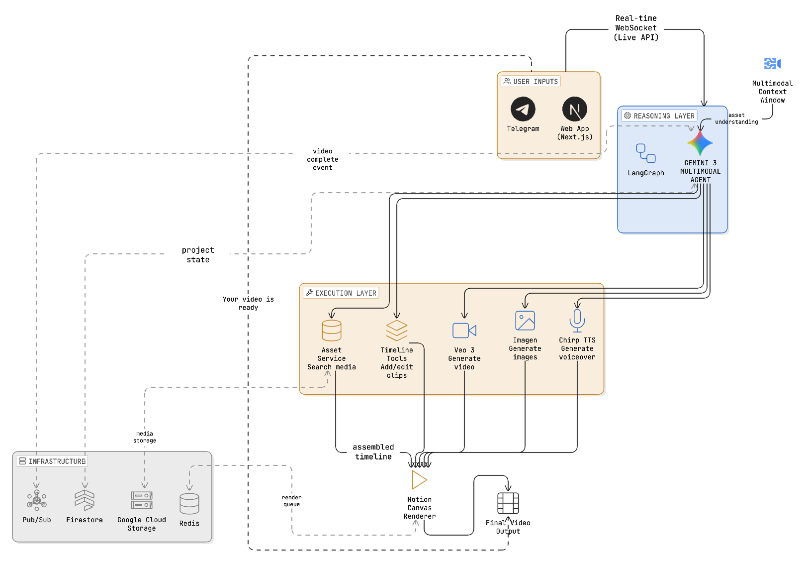
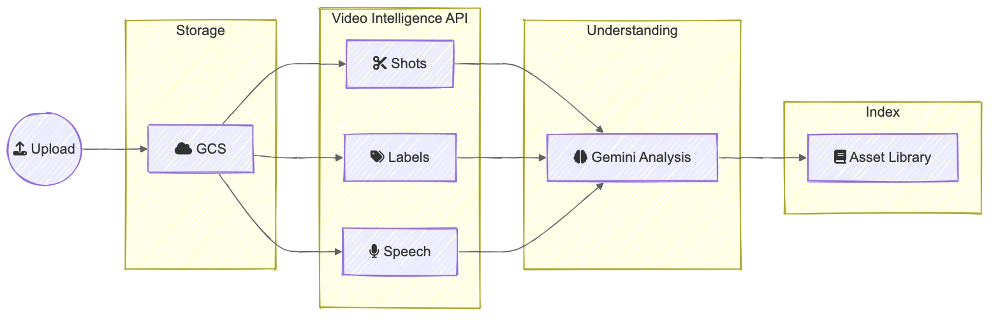
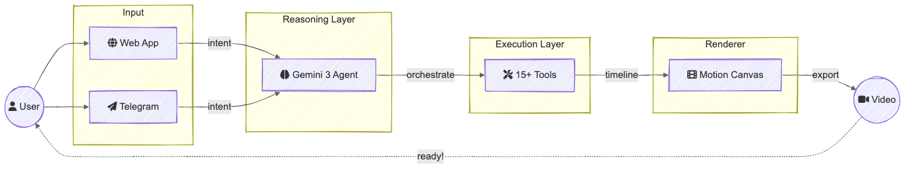
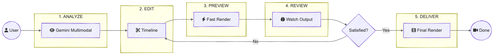
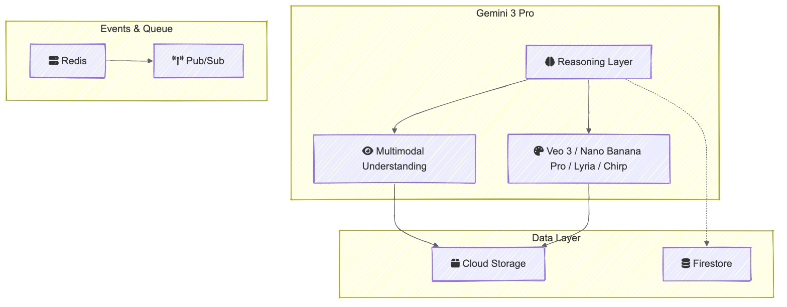

# Gemini Studio

<div align="center">


### The Execution Layer for Agentic Video

**Generative AI solved pixel generation. We're solving video production.**

**The deterministic engine that gives AI agents the hands to edit video.**

*Built for the [Gemini 3 Hackathon](https://gemini3.devpost.com)*




</div>

---

> **The Bet:** In 2 years, manual video editing will be obsolete for 90% of use cases. The bottleneck isn't AI models—it's the lack of infrastructure that lets agents *actually edit*. We're building that missing layer.

> **The Moat:** Gemini Studio is the **first video editor that understands your assets and clips semantically.** The system organizes everything for you—no more renaming each file by hand or wasting hours in bins. Search your library in plain language (e.g. *the drone shot over the water*, *the clip where the crowd cheers*); the agent uses the same understanding to resolve which asset or clip you mean. Semantic understanding turns natural language into precise edits.

---

## Demo & submission

| Item | Link |
|------|------|
| **Live demo** | https://www.geminivideo.studio/ |
| **Repository** | https://github.com/youneslaaroussi/geministudio |

---

## Table of Contents

- [The Problem](#the-problem-ai-can-generate-pixels-but-it-cant-produce-video)
- [The Solution](#the-solution-an-execution-layer-for-ai-agents)
- [Why Not a Plugin? A Ground-Up Redesign](#why-not-a-plugin-a-ground-up-redesign)
- [Why This Changes Everything](#why-this-changes-everything)
- [Gemini 3 Pro: The Reasoning Layer](#gemini-3-pro-the-reasoning-layer)
- [Architecture](#components)
- [How the Execution Layer Works](#how-the-execution-layer-works)
- [Motion Canvas: The Perfect Rendering Layer for LLMs](#motion-canvas-the-perfect-rendering-layer-for-llms)
- [Autonomous Video Production: The Agent Can Watch Its Own Work](#autonomous-video-production-the-agent-can-watch-its-own-work)
- [Tech Stack](#tech-stack)
- [Setup](#setup)
- [Credits & Resources](#credits--resources)
- [License](#license)

---

## The Problem: AI Can Generate Pixels, But It Can't *Produce* Video

**Veo solved generation. But it didn't solve production.**

A raw AI-generated clip is not a finished video. It has no narrative structure, no pacing, no intent. The bottleneck isn't the model—it's the lack of a rendering engine that can translate an agent's text-based intent into a frame-perfect video edit.

We're moving from **"Tools for Editors"** (e.g. Premiere Pro) to **"Directors for Agents."**

---

## The Solution: An Execution Layer for AI Agents

**Gemini Studio is the infrastructure that gives AI agents hands.**

We built the deterministic engine that allows an agent to:
- **Ingest** raw footage (screen recordings, generated clips, uploads)
- **Organize & search** — Assets and clips are indexed by content. No manual renaming; find anything by describing it (*the wide shot*, *that B-roll of the product*). The agent uses the same semantic layer for both assets and clips.
- **Understand** your intent—that title card, the drone shot, zoom in on the error—no file names, no hunting
- **Execute** the edit programmatically—frame-perfect, no human in the loop

This isn't a chatbot wrapper. The agent has **real agency**: it calls the renderer, manipulates the timeline, triggers Veo 3/Nano Banana Pro/Lyria/Chirp generation, and proactively notifies you when your video is ready. Gemini 3 Pro becomes the **reasoning layer** for the entire production stack.

**The result:** Video creation transforms from a manual craft into a scalable API call.

---

## Why Not a Plugin? A Ground-Up Redesign

**You can't bolt agentic capabilities onto software built for humans.**

A Premiere Pro plugin is fundamentally limited: it automates UI clicks, parses menus, and simulates mouse movements. It's brittle, slow, and constrained by the editor's human-centric architecture. The agent is a **guest** in someone else's house, following rules it didn't write.

**Gemini Studio is built from the ground up with agent-native tools and code.**

### Agent-Native Architecture

| Aspect | Plugin Approach | Gemini Studio (Ground-Up) |
|--------|----------------|--------------------------|
| **Timeline Control** | UI automation, brittle clicks | Programmatic API—deterministic, version-controlled |
| **Asset Resolution** | File paths, manual matching | Semantic understanding—resolve by meaning, not filename |
| **Rendering** | Export dialogs, progress bars | Headless renderer—API-driven, event-based |
| **State Management** | Screen scraping, guessing | Native state—the agent knows exactly what's on the timeline |
| **Iteration** | Can't watch its own work | Full loop—agent analyzes output and iterates autonomously |
| **Branching** | Impossible—single timeline | Git-style branches—agent edits on branches, you merge |

### What Only a Ground-Up Design Enables

**1. Semantic Asset Resolution**
Plugins can't change how Premiere indexes assets. We built semantic understanding into the core—every upload is analyzed, every clip is searchable by content. The agent doesn't need file paths; it resolves *"the drone shot"* by understanding what's in your library.

**2. Deterministic Rendering**
Plugins trigger exports through UI dialogs. Our renderer is headless and API-driven—the agent calls `render()` with exact parameters, gets events on completion, and can iterate without human intervention.

**3. Version-Controlled Timelines**
Traditional editors have one timeline state. We built branching into the architecture—the agent edits on a branch, you review and merge. This requires ground-up state management that plugins can't provide.

**4. Agent-Native Tools**
Our 18+ tools aren't wrappers around UI actions—they're first-class operations designed for programmatic control. `add_clip()`, `apply_transition()`, `search_assets()` are deterministic functions the agent calls directly, not UI simulations.

**5. Autonomous Iteration**
The agent can watch its own renders, critique them, and adjust—a capability that requires tight integration between rendering, analysis, and timeline manipulation. Plugins can't close this loop.

**The code is agent-native.** Every component—from asset ingestion to final render—is designed for programmatic control. The agent isn't simulating a human editor; it's using tools built for it.

---

## Why This Changes Everything

### Vibe Editing
Describe the *feeling* you want. "Make it punchy." "Slow it down for drama." "Add energy to this section." The agent understands vibes and translates them into concrete editing decisions—cuts, zooms, pacing, transitions.

### The Cursor for Video Editing
Just like Cursor revolutionized coding by letting AI agents write alongside you, Gemini Studio lets AI agents *edit alongside you*. Same project. Same timeline. Human and agent, co-directing in real-time.

### Git-Style Branching for Video
Your timeline is version-controlled. The cloud agent edits on a branch. You review the changes. Merge what you like, discard what you don't. Split timelines, experiment freely, sync seamlessly.

| Feature | What It Enables |
|---------|-----------------|
| **Semantic assets & clips** | No manual renaming—the system organizes and indexes by content. Search your library in plain language; refer to assets and clips by what they *are*. The agent resolves "the drone shot," "that B-roll," etc. by meaning, not filename. |
| **Vibe Editing** | Intent-based editing ("make it cinematic") |
| **Real-time Sync** | Agent edits appear live in your timeline |
| **Branching** | Non-destructive experimentation |
| **Merge/Split** | Combine agent work with your own edits |

This isn't automation. This is **collaboration between human directors and AI agents.**

---

## Gemini 3 Pro: The Reasoning Layer

Gemini 3 Pro isn't just integrated—it's the brain that makes agentic video possible. We leverage its state-of-the-art reasoning and native multimodal understanding to power every layer of the stack.

**Agent Brain (LangGraph + Gemini 3 Pro)**
Every interaction flows through Gemini 3 Pro. It reasons over project state, decides which tools to invoke, and orchestrates the entire editing pipeline. We use dynamic `thinking_level` to balance reasoning depth with response latency. Without Gemini 3 Pro's reasoning and tool use, there is no execution layer—only a traditional UI waiting for human input.

**Multimodal Understanding (1M Token Context Window)**
The agent doesn't just receive text—it *sees* and *hears*. Gemini 3 Pro can comprehend video, images, and audio natively through its 1 million token context window. We use the `media_resolution` parameter to optimize token usage while maintaining fidelity for scene detection, object recognition, and transcription.

**Asset & Clip Intelligence Pipeline**
Every uploaded asset and every clip goes through Gemini 3 Pro's multimodal analysis:
- **Scene Detection** — Automatic boundary identification using native video understanding
- **Object Recognition** — Context-aware detection throughout the video
- **Speech Transcription** — Full audio-to-text with word-level timestamps
- **Semantic Understanding** — High-level analysis ("what's happening here?")

The system organizes your library by content—no renaming files by hand. Search assets and clips in plain language; the agent uses the same indexing. It doesn't just know *that* you have a video—it knows *what's in it*, frame by frame. **This is the moat:** you say *put the title card over the drone shot* and the agent resolves which image and which clip by meaning, not by filename. No other editor does this.



**Generative Pipeline (Veo 3, Nano Banana Pro, Lyria, Chirp)**
The agent doesn't just edit existing footage—it creates. Need b-roll? Veo 3. Need a thumbnail? Nano Banana Pro. Need background music? Lyria. Need narration? Chirp TTS. These aren't add-ons; they're first-class tools the agent invokes autonomously based on narrative intent.

**The Stack:**
| Layer | Role |
|-------|------|
| **Gemini 3 Pro** | Reasoning + tool orchestration + multimodal understanding |
| **Files API** | Media upload and processing |
| **Veo 3 / Nano Banana Pro / Lyria / Chirp** | Generative media creation |
| **Motion Canvas** | Deterministic frame-perfect rendering |

This is the full loop: **ingest → perceive → reason → generate → render.**

---

## Components

| Component           | Tech                         | Port (default) | README                    |
|--------------------|------------------------------|----------------|---------------------------|
| **app**            | Next.js                      | 3000           | [app/README.md](app/README.md) |
| **langgraph_server** | FastAPI, LangGraph, Gemini   | 8000           | [langgraph_server/README.md](langgraph_server/README.md) |
| **Telegram agent** | Same LangGraph server, webhook | —              | [langgraph_server/README.md](langgraph_server/README.md#chat-providers) |
| **asset-service**  | FastAPI, GCS, Firestore      | 8081           | [asset-service/README.md](asset-service/README.md) |
| **renderer**       | Express, BullMQ, Puppeteer, FFmpeg | 4000    | [renderer/README.md](renderer/README.md) |
| **scene**          | Motion Canvas, Vite          | (build only)   | — |
| **video-effects-service** | FastAPI, Replicate | —        | [video-effects-service/README.md](video-effects-service/README.md) |
| **billing-service** | NestJS, Firebase             | —              | [billing-service/README.md](billing-service/README.md) |

---

## How the Execution Layer Works



**1. Agent Receives Intent** — User speaks naturally (web or Telegram). The Gemini 3 Pro agent parses the request and plans the execution.

**2. Tools Execute Autonomously** — The agent invokes 15+ tools: timeline manipulation, asset search, Veo generation, image creation, TTS. Each tool is a deterministic operation the agent controls.

**3. Renderer Produces Output** — Motion Canvas renders the final video headlessly—pixel-perfect, production-ready. Pub/Sub events notify the agent on completion.

**4. Agent Closes the Loop** — "Your video is ready." The agent proactively informs the user. No polling. No waiting. Full autonomy.

---

## Motion Canvas: The Perfect Rendering Layer for LLMs

**Motion Canvas is the secret sauce that makes agentic video editing possible.**

We chose [Motion Canvas](https://motioncanvas.io/) as our rendering engine because it's built for code-first animation—exactly what LLMs excel at. Unlike traditional video editors that require UI automation, Motion Canvas uses **React-like TypeScript code** that agents can generate naturally.

### Why Motion Canvas is Perfect for AI Agents

**Code-First Architecture**
Motion Canvas animations are written as TypeScript generator functions. The agent doesn't simulate clicks or drags—it writes code:

```typescript
export default makeScene2D(function* (view) {
  const circle = createRef<Circle>();
  view.add(<Circle ref={circle} width={320} height={320} fill={'blue'} />);
  yield* circle().scale(2, 0.3);
  yield* circle().fill('green', 0.3);
});
```

This is **exactly what LLMs are trained to do**: generate code. The agent can compose complex animations, transitions, and effects by writing TypeScript—a task it's already excellent at.

**Multimodal Capabilities**
Motion Canvas integrates seamlessly with Gemini's multimodal understanding. The agent can:
- **Analyze** video frames to understand composition
- **Generate** code that matches visual intent
- **Iterate** by watching renders and adjusting code
- **Compose** complex scenes with multiple layers, effects, and transitions

**Deterministic & Headless**
Motion Canvas renders deterministically—same code, same output, every time. Combined with Puppeteer, we can render headlessly in the cloud. The agent calls `render()`, gets pixel-perfect output, and can iterate without human intervention.

**Production-Ready**
Motion Canvas isn't a prototype—it's battle-tested for production-quality animations. The agent generates code that produces broadcast-ready video, not experimental output.

**The Result:** Motion Canvas turns video editing from a visual craft into a coding problem—and coding is what LLMs do best. The agent writes TypeScript, Motion Canvas renders it, and you get professional video. This is why agentic video editing works: **we're using the right tool for the job.**

---

## Autonomous Video Production: The Agent Can Watch Its Own Work

**This is the moat.** Gemini Studio is the first platform where an AI agent can autonomously iterate on video edits without human intervention.

### The Iteration Loop

<div align="center">

</div>

### Why This Matters

**Traditional AI video tools:** Generate → Done. No feedback loop. No iteration.

**Gemini Studio:** Generate → Watch → Critique → Adjust → Repeat → Deliver.

The agent has:
- **Eyes** (Gemini multimodal can analyze video content)
- **Hands** (18 tools for timeline manipulation)
- **Judgment** (can evaluate pacing, cuts, transitions)
- **Memory** (maintains context across iterations)

This is the difference between a tool that produces output and an agent that produces *quality* output.

### Live Voice Chat: Real-Time Collaboration

Gemini Studio includes **Live API integration** for real-time voice conversations with the AI agent. The agent can execute tools, manipulate your timeline, and even "see" previews of your work—all through natural voice commands.

**Current:** When you ask the agent to watch your video, it extracts key frames using [Mediabunny](https://mediabunny.dev/) and analyzes them to understand the composition.

**Future Vision:** The Live API will continuously stream what you see—the same preview panel, at 5x playback speed—directly to the agent. This creates a true "pair editing" experience where the AI watches alongside you in real-time, ready to act on voice commands like *"that cut was too early"* or *"add a transition here"*. The agent becomes a co-director who sees exactly what you see.

### Render Quality Controls

The agent intelligently chooses render settings based on intent:

| Mode | Settings | Use Case |
|------|----------|----------|
| **Preview** | `quality='low'`, `fps=15`, `range=[start,end]` | Fast iteration, reviewing segments |
| **Draft** | `quality='web'`, full timeline | Near-final review |
| **Production** | `quality='studio'`, full timeline | Final delivery |

---

## Tech stack



| Category     | Technology              | Purpose |
|-------------|--------------------------|---------|
| Frontend    | Next.js, React           | Web app, timeline editor, chat UI |
| Agent       | LangGraph, Gemini        | Conversational agent, tools |
| Render      | Motion Canvas, Puppeteer | Headless video composition |
| Queue       | BullMQ, Redis            | Render job queue |
| Backend     | FastAPI (Python)         | LangGraph server, asset service, video-effects-service |
| Storage     | GCS, Firestore           | Assets, metadata, projects |
| Events      | Google Cloud Pub/Sub     | Render completion, pipeline events |
| Auth        | Firebase                 | Auth, projects, chat sessions |
| Monorepo    | pnpm workspaces          | app, scene, renderer, shared |

The codebase is a pnpm monorepo with TypeScript (app, scene, renderer) and Python (langgraph_server, asset-service, video-effects-service). The LangGraph server and asset service include tests; the agent and tools are typed and documented for maintainability.

---

## Setup

### Prerequisites

- **Node.js** 20+, **pnpm** 9 (`corepack enable pnpm`)
- **Python** 3.11+ (e.g. `uv` or `pip`)
- **Redis** (for the renderer queue)
- **Google Cloud** – GCS, optional Pub/Sub, Firebase
- **Chrome or Chromium** (for the renderer)

### Install

```bash
git clone https://github.com/youneslaaroussi/geministudio
cd geministudio
pnpm install
pnpm --filter @gemini-studio/scene run build
pnpm --filter @gemini-studio/renderer run build:headless
```

### Environment

Copy the example env file for each service you run; set API keys and URLs. Details are in each service’s README.

| Service        | Config |
|----------------|--------|
| App            | `app/env.template` → `app/.env.local` |
| LangGraph      | `langgraph_server/.env.example` → `langgraph_server/.env` |
| Renderer       | `REDIS_URL` (and optional Pub/Sub) in `renderer/` |
| Asset service  | `asset-service/.env.example` → `asset-service/.env` |

### Run locally

**Option A: All services at once (recommended)**

Requires [Overmind](https://github.com/DarthSim/overmind) (`brew install overmind`). Starts all 6 services in a unified TUI with per-service panes, logs, and controls.

```bash
pnpm dev
```

| Command | Description |
|---------|-------------|
| `pnpm dev` | Start all services (Overmind TUI) |
| `pnpm dev:connect` | Connect to the Overmind session |
| `pnpm dev:restart` | Restart all or specific services |
| `pnpm dev:stop` | Stop all services |
| `pnpm dev:status` | Show service status |

In the Overmind TUI: press a service's key (e.g. `1` for app, `2` for renderer) to focus its pane; `q` to quit.

**Option B: Without Overmind**

If Overmind isn't installed, use the simple concurrent runner:

```bash
pnpm dev:simple
```

**Option C: Separate terminals**

1. Start **Redis**.
2. In separate terminals, start each service:

   **Terminal 1 – Renderer**
   ```bash
   pnpm --filter @gemini-studio/renderer dev
   ```

   **Terminal 2 – LangGraph**
   ```bash
   cd langgraph_server && uv run uvicorn langgraph_server.main:app --reload --port 8000
   ```

   **Terminal 3 – Asset service**
   ```bash
   cd asset-service && uv run python -m asset_service
   ```

   **Terminal 4 – App**
   ```bash
   pnpm --filter app dev
   ```

   Optionally add **billing-service** (`cd billing-service && pnpm start:dev`) and **video-effects-service** (`cd video-effects-service && uv run python -m video_effects_service`).

3. Open **http://localhost:3000**. If the LangGraph server is elsewhere, set `NEXT_PUBLIC_LANGGRAPH_URL` in the app env.

### Production Deployment

See [deploy/README.md](deploy/README.md) for full instructions. Key step: **CI/CD does not copy service account files** — you must manually provision them on the VM:

```bash
# Copy service accounts to VM (one-time setup)
gcloud compute scp secrets/google-service-account.json gemini-studio:/tmp/ --zone=us-central1-a
gcloud compute scp secrets/firebase-service-account.json gemini-studio:/tmp/ --zone=us-central1-a
gcloud compute ssh gemini-studio --zone=us-central1-a --command='
  sudo mv /tmp/google-service-account.json /opt/gemini-studio/deploy/secrets/
  sudo mv /tmp/firebase-service-account.json /opt/gemini-studio/deploy/secrets/
  sudo chmod 644 /opt/gemini-studio/deploy/secrets/*.json
'
```

---

## Repository structure

```
GeminiStudio/
├── app/                    # Next.js app (editor, chat, assets UI)
├── scene/                  # Motion Canvas project (Vite)
├── renderer/               # Render service (Express, BullMQ, headless bundle)
├── langgraph_server/       # LangGraph agent (FastAPI, Gemini 3, tools)
├── asset-service/          # Asset upload & pipeline (Gemini analysis, GCS, Firestore)
├── video-effects-service/  # Video effects (FastAPI, Replicate)
├── billing-service/        # Credits & billing (NestJS)
├── shared/                 # Shared tool manifest (shared/tools/manifest.json)
├── deploy/                 # Terraform, Caddy, docker-compose
├── package.json            # Root pnpm workspace
├── pnpm-workspace.yaml
└── README.md               # This file
```

**Key areas:**

| Area          | Path |
|---------------|------|
| Agent & tools | `langgraph_server/agent.py`, `langgraph_server/tools/` |
| Tool manifest | `shared/tools/manifest.json` |
| Renderer      | `renderer/` |
| Scene         | `scene/` |
| App           | `app/app/` |

Each service has its own README for setup and deployment.

---

## Credits & Resources

Gemini Studio is built on top of incredible open-source projects and cloud services. We're grateful to the communities that made this possible.

### Rendering & Media

- **[Motion Canvas](https://motioncanvas.io/)** — The rendering engine that makes code-first video editing possible. React-like TypeScript API perfect for LLM-generated animations. [GitHub](https://github.com/motion-canvas/motion-canvas) · [Docs](https://motioncanvas.io/docs/)
- **[FFmpeg](https://ffmpeg.org/)** — Audio/video transcoding, merging, and encoding in the renderer. We use it via [fluent-ffmpeg](https://github.com/fluent-ffmpeg/node-fluent-ffmpeg).
- **[Puppeteer](https://pptr.dev/)** — Headless Chrome for running Motion Canvas and exporting frame-perfect video in the cloud.
- **[Mediabunny](https://mediabunny.dev/)** — JavaScript library for reading, writing, and converting video and audio in the browser. Web-first media toolkit.

### AI & Agent

- **[Vercel AI SDK](https://sdk.vercel.ai/)** — React hooks and streaming for the chat UI. We use `ai`, `@ai-sdk/react`, and `@ai-sdk/google` for the frontend agent experience.
- **[LangGraph](https://langchain-ai.github.io/langgraph/)** — Agent orchestration and tool execution. Powers our conversational agent. [GitHub](https://github.com/langchain-ai/langgraph)
- **[Google Gemini 3 Pro](https://deepmind.google/technologies/gemini/)** — Reasoning, tool use, multimodal understanding (video, images, audio), and generative APIs (Veo, Imagen, Lyria, Chirp).

### Google Cloud & Firebase

*Used for background asset understanding and indexing (the agent’s live reasoning and multimodal understanding are powered by Gemini).*

- **[Cloud Video Intelligence API](https://cloud.google.com/video-intelligence)** — Background shot detection, label detection, and video understanding in the asset pipeline so the library is searchable.
- **[Cloud Speech-to-Text](https://cloud.google.com/speech-to-text)** — Background transcription with word-level timestamps so assets are searchable and captions can be generated.
- **[Cloud Text-to-Speech](https://cloud.google.com/text-to-speech)** — Narration and TTS (Chirp) integration.
- **[Cloud Storage](https://cloud.google.com/storage)** — Asset and render output storage.
- **[Cloud Pub/Sub](https://cloud.google.com/pubsub)** — Render completion and pipeline events.
- **[Firebase](https://firebase.google.com/)** — Auth, Firestore (projects, metadata), and real-time sync.

### Search, Conversion & Effects

- **[Algolia](https://www.algolia.com/)** — Semantic and full-text search over the asset library.
- **[CloudConvert](https://cloudconvert.com/)** — Image and document conversion in the asset pipeline.
- **[Replicate](https://replicate.com/)** — Video effects (e.g. background removal, chroma key) via the video-effects-service.

### Frameworks & Infrastructure

- **[Next.js](https://nextjs.org/)** — Web app and API routes.
- **[FastAPI](https://fastapi.tiangolo.com/)** — LangGraph server, asset-service, video-effects-service.
- **[BullMQ](https://docs.bullmq.io/)** — Render job queue (Redis-backed).
- **[Automerge](https://automerge.org/)** — CRDTs for collaborative timeline and branch sync.

---

### Built by [Younes Laaroussi](https://youneslaaroussi.ca)

| | Link |
|---|------|
| **Site** | [youneslaaroussi.ca](https://youneslaaroussi.ca) |
| **LinkedIn** | [linkedin.com/in/younes-laaroussi](https://linkedin.com/in/younes-laaroussi) |
| 𝕏 | [@younesistaken](https://x.com/younesistaken) |

---

## License

**Elastic License 2.0 (ELv2)** – See [LICENSE](LICENSE).

You may use, copy, distribute, and make derivative works of the software. You may **not** offer it to third parties as a hosted or managed service (i.e. you cannot run “Gemini Studio as a service” for others). You must keep license and copyright notices intact and pass these terms on to anyone who receives the software from you.
